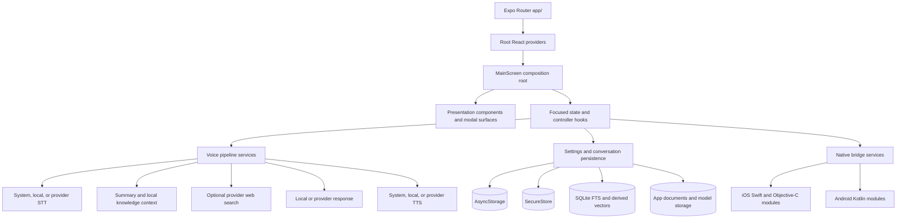
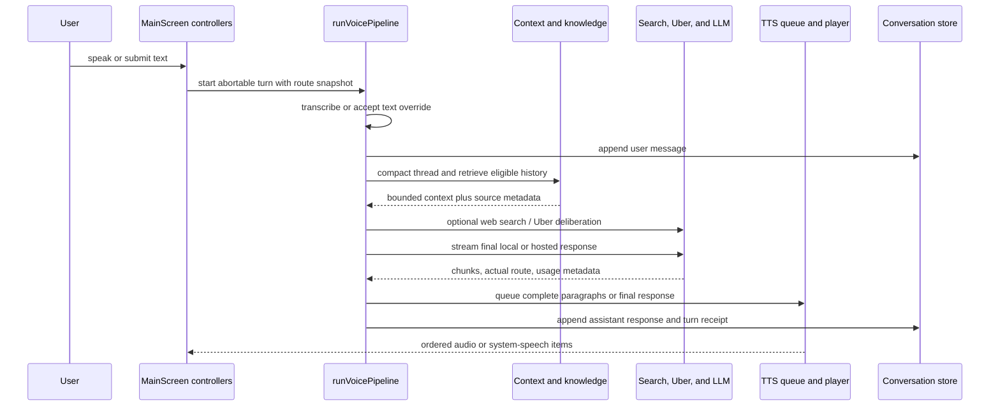
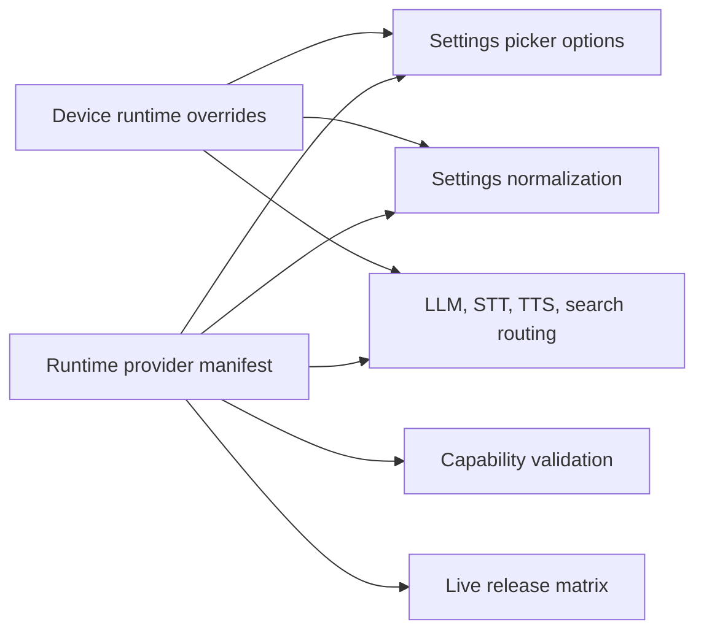

# Mr Broccoli Design

## Runtime Architecture

## Composition

`app/_layout.tsx` initializes the global provider order:

1. gesture handling;
2. shared settings;
3. localization derived from loaded settings;
4. Premium entitlement;
5. theme and typography; and
6. Expo Router navigation.

`app/index.tsx` renders `MainScreen`. `MainScreen` is intentionally a
composition root: it connects settings, conversations, recording, recognition,
playback, Premium/Free policy, setup, backup, archives, diagnostics, and
secondary surfaces. Runtime work belongs in hooks and services rather than in
the JSX presentation tree.

**Decision:** Keep one primary conversation workspace. Provider choice,
settings, history, setup, receipts, and diagnostics are secondary surfaces so
the default experience remains voice-first even though expert controls remain
available.

## Voice-Turn Flow

Every turn captures a route snapshot before execution so UI changes cannot
silently mutate an in-flight request. One abort signal propagates through
recording-dependent work, search, model requests, deliberation, and speech
queueing. The pipeline reports semantic phase changes through callbacks; the
screen maps those events to visual state and accessibility announcements.

**Decision:** Failed provider transcription retains the captured audio for
recovery when the user did not abort. Successful or intentionally aborted turns
clean up temporary captured audio.

## Context Layers

Context enters a model request in explicit layers:

1. product and response-style instructions;
2. optional compact summary of older messages from the active conversation;
3. a bounded verbatim window of recent active-conversation messages;
4. optional source-labelled excerpts from other non-private conversations;
5. optional web-search context;
6. optional private Model Council synthesis context; and
7. the current user turn and its approved image attachments.

**Decision:** These layers are kept distinct so provenance and prompt-injection
boundaries remain inspectable. Historical summaries, retrieved excerpts, web
results, images, and private deliberation text are data. Prompt builders mark
them accordingly, and streamed output is guarded against accidentally exposing
serialized internal context.

Local LLM turns skip provider-backed summary refresh and provider web search;
they can still use an existing active-conversation summary and locally retrieved
history. This preserves the offline execution claim.

## Persistence Architecture

| Data | Authority | Storage | Portable backup |
| --- | --- | --- | --- |
| Public settings | `Settings` minus `apiKeys` | AsyncStorage `@mrbroccoli/settings` | Yes |
| Provider API keys | user-entered secret | SecureStore `mrbroccoli.provider_key.<provider>` | Never |
| Conversation metadata | conversation hook | AsyncStorage `@mrbroccoli/conversations` | Rebuilt from records |
| Conversation records | conversation hook | AsyncStorage `@mrbroccoli/conversation/<id>` | Yes |
| Active conversation ID | conversation hook | AsyncStorage `@mrbroccoli/active_conversation` | Optional restore target |
| Image attachments | conversation record plus app document | app documents, stored by stable attachment ID | Embedded in backup v2 |
| Past-conversation index | derived cache | SQLite with FTS5 and local vectors | Never |
| Runtime capability overrides | provider-confirmed device state | AsyncStorage | Never |
| Local model installs and benchmarks | device-operational state | app/model storage plus local state | Never |
| Premium cache | verified local entitlement | SecureStore | Never |
| Debug captures | sanitized bounded diagnostics | temporary/app diagnostics files | Never |

Settings and conversation writes are serialized per storage key. This prevents
an older asynchronous write from overwriting a newer user action. Loading waits
for pending writes before reading the same key.

**Decision:** Settings normalization is write-forward. Legacy, removed, or
invalid fields are migrated into the current shape at load time and the
normalized public representation is persisted. Keeping migration in one
boundary avoids scattering compatibility defaults through UI and service code.

## Conversation Structure

Conversation metadata is loaded first for fast drawers and search. Full records
hydrate lazily. Each record owns messages, per-conversation overrides, summary,
branch origin, privacy state, usage events, and knowledge exclusions.

Branches copy messages only through a selected checkpoint, assign new message
and attachment IDs, preserve applicable conversation settings and privacy, and
record root/parent/checkpoint provenance. Members of one branch family exclude
one another from cross-session knowledge so the same shared history is not
retrieved as multiple independent sources.

**Decision:** Restore is non-destructive. Identical records are skipped;
conflicting IDs become copies; branch references and family exclusions are
remapped to restored IDs. Existing API keys and unrelated device state survive.

## Provider Routing

The checked-in runtime manifest owns the supported hosted provider set,
transport, curated model routes, effort mappings, speech capabilities, voice
defaults, and provider order. UI helpers and service routers derive from it.

**Decision:** User-facing model lists are curated executable contracts, not raw
provider catalogues. Stable snapshots are preferred over rolling aliases when
both describe the same model. A model requiring a different API shape is not
listed until that transport is implemented.

Provider retries and fallbacks are bounded and classified. Authentication and
credit failures are terminal. Transient failures may retry or advance through
curated fallbacks. Actual-route metadata is retained so fallback never becomes
invisible.

## Speech Design

STT and TTS selection are independent from the response model. Capability and
language checks occur before execution.

- Native recognition is preferred when it satisfies the selected on-device
  policy.
- Downloaded speech models are selected from the curated local catalogue.
- Android native capture writes mono 16 kHz PCM WAV so the captured file is a
  valid input to both downloaded Sherpa recognition and provider speech routes;
  metering is derived from the same PCM stream without retaining it in
  diagnostics.
- Provider routes reuse the provider key but retain independent model,
  language, timeout, and validation behavior.
- TTS transforms visual response text into speakable text before chunking.
- Streaming playback queues completed paragraphs. Provider/local synthesis may
  prefetch concurrently, but output is emitted in source order.
- “Wait” playback buffers non-native synthesis until the response is complete.
- Explicit paragraph pauses provide stable cadence without relying on
  engine-specific whitespace behavior.

**Decision:** Voice character must never change silently. Provider and local
fallbacks are ordered user choices, and each attempt is represented in speech
diagnostics and the turn receipt.

## On-Device Capability Design

The local catalogue separates a logical capability from an exact downloadable
artifact. Device selection has four stages:

1. filter hard incompatibilities using platform, architecture, OS, language,
   memory, and storage;
2. download from the pinned source and verify SHA-256 before installation;
   Piper VITS voices also install their pinned libphonemize language pack before
   they are reported usable;
3. load and benchmark the exact artifact on the current device; and
4. construct one coherent offline profile from compatible LLM/STT/TTS routes.

On iOS, Sherpa extracts speech archives with an explicit safe-entry policy:
empty, `.` and `./` root records are ignored; every other entry must be a
relative regular file or directory without parent traversal, symbolic links, or
hard links. Direct validation rejects unsafe archive paths before the helper
rewrites accepted entries under its absolute installation directory, while
libarchive's symlink protection applies when data is written. This avoids
string-prefix checks and incompatible archive-writer path flags.

Preparation runs regardless of transient thermal, memory, or battery-saver
pressure; the OS throttles on its own. Pressure is recorded per benchmark, and
a missed-target verdict measured under pressure is never persisted as a durable
incompatibility. Model quality tiers and measured device performance influence
automatic selection; explicit advanced overrides remain possible only for
functionally viable models.

## Edition Enforcement

Premium state is provided above the main screen. The main screen derives
effective runtime settings through the Free offline controller and passes
edition-aware capabilities to presentation and settings surfaces.

**Decision:** Production builds fail closed. Entitlement simulation is allowed
only when the exact application ID ends in `.dev` or `.maestro`, determined by
native runtime identity. Store-promo fixtures are additionally restricted to
`.maestro`; neither facility can activate in the production package.

## Native Boundaries

React Native owns product state and orchestration. Native modules exist where
the operating system or lifecycle requires them:

- audio queue coordination and race-safe playback;
- waveform capture and rendering;
- background voice-turn continuation and foreground-service behavior;
- iOS Live Activity / Android notification remote controls;
- device memory, storage, architecture, and thermal diagnostics;
- native backup key derivation and encryption support; and
- iOS archive directory integration.

Native changes require platform tests and a fresh native build. Expo Go cannot
validate these boundaries.

## Diagnostics and Failure Design

Operational events carry IDs, phases, durations, provider/model identifiers,
safe failure categories, and state transitions. Sanitization happens before an
event enters persisted or clipboard output and is repeated during finalization
and legacy recovery.

**Decision:** Diagnostics optimize for reconstructing control flow, not
capturing payloads. Content fingerprints and app-owned stack frames are safer
than retaining user text or upstream bodies that may contain secrets.

Persistence errors surface to the user through a shared alert path. Provider
errors are classified for retry/fallback decisions without treating temporary
account or network state as a durable capability fact.

## Release Architecture

Repository metadata is the version authority. The version-bump script changes
Expo/package versions and native counters together. Release validation is
ordered to fail before cost:

Release bundles disable Expo dotenv loading and are scanned for configured
local secret values. Android release output must retain R8 mapping, native
symbols, signing identity, package/version metadata, and configured size
budgets. The generated artifact archive is evidence, not a replacement for the
source commit from which it was built.

## Boundary Rules

- `app/` owns routing and global providers, not product workflows.
- `src/screens/` composes feature controllers and presentation.
- `src/hooks/` owns React lifecycle and persistent state adapters.
- `src/services/` owns runtime work and platform/provider integration.
- `src/constants/` owns curated static contracts and manifests.
- `src/features/` owns complete secondary product surfaces.
- `src/design-system/` owns reusable native controls and icon semantics.
- `android/` and `ios/` own OS-specific implementations, not independent
  product policy.
- `scripts/` and `Makefile` own reproducible validation and release operations.

Child living specs refine these boundaries and contain the closer evidence.
