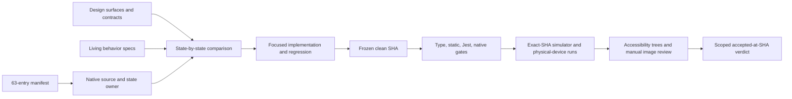

# Design-system reconciliation design

## Evidence model

Every matrix row uses one of these statuses:

| Status               | Meaning                                                                                                             |
| -------------------- | ------------------------------------------------------------------------------------------------------------------- |
| `mapped`             | The native owner is located; no visual or functional verdict follows.                                               |
| `pending-validation` | A mapped implementation or fix still lacks some acceptance evidence, most often exact-SHA native and visual review. |
| `blocked-owner`      | Product or design authority must resolve a material choice before implementation can be accepted.                   |
| `accepted@<sha>`     | The stated evidence passed for that exact immutable SHA and scope only.                                             |
| `retired`            | The name is absent from the current manifest and current app references; it is not a parity target.                 |

Do not upgrade `mapped` because a unit test exists, or carry an
`accepted@<sha>` verdict onto a descendant commit or dirty worktree.

## Mapping method

The 63 manifest entries map in four ways:

1. **Direct component** — for example `ProviderIcon` to
   `src/components/ProviderIcon.tsx`.
2. **Native composition with a deliberate name difference** — for example
   `AnchoredMenu` to `ConversationActionMenu`, `InstallProgress` to
   `InstallProgressBar`, and `RoutePicker` to `RoutePickerSheet`.
3. **Shared primitive host** — `Button`, `Input`, `TextArea`, `Tag`, `List`,
   `ListItem`, and `Modal` live in `NativeControls.tsx`.
4. **Runtime or localized contract** — specimen constants such as
   `INTRO_COPY`, `DEFAULT_MANUAL_GROUPS`, `DEMO_TURN`, `AUTO_SETUP_PLAN`, and
   `AUTO_SETUP_FACTS` map to locale dictionaries, catalogues, hooks, and live
   device readings rather than copied fixture values.

Retired names and historical `Ant*` names never receive compatibility rows.
The matrix records the current owner instead.

## Reconciliation loop

The current implementation passed `Freeze` and the spend-free `Gates` at
`db1d59b4c8ff56fea3ee8ab66cb1ba57c2174ffa`. The loop stops before `Devices`:
no rebuilt exact-SHA simulator matrix or physical-device review was performed,
so source candidates remain `pending-validation` rather than accepted.

## Native proof

Deterministic fixtures cover every representable state on an Android emulator
and iOS simulator. Real flows cover navigation, persistence, permissions,
cancellation, retry, rotation, themes, locale, text size, and screen-reader
focus. Physical Android and iPhone runs additionally cover microphone and
recognizer behavior, local model installation and benchmark, synthesis and
playback, background/lifecycle transitions, and memory constraints.

Compare hierarchy, geometry, tokens, copy, state, touch target, and
accessibility semantics—not browser pixels. Platform font rasterization may
differ; missing content, wrong ownership, wrong dimensions, or unusable native
interaction may not.

## Authority conflicts

When vendored sources disagree, keep the conflict visible and request an owner
decision or upstream correction. Current known examples include:

- `workspace.md` both says `ResponseModeToggle` remains and later says it was
  deleted; the manifest and app agree it is deleted.
- Workspace material disagrees on circular versus squircle composer geometry,
  and on grip-only versus named transcript-sheet chrome; the specific current
  component/surface contract and app mapping are retained pending upstream
  cleanup.
- `Toast.jsx` has no accent stripe while its prompt and announcements prose
  still describe one; the current component geometry is the implementation
  target and the prose needs correction.
- The intro kit uses an exclamation in “Try it out!” while the content charter
  bans exclamation marks; the app follows the charter pending design cleanup.

These conflicts are not permission to edit the vendored mirror or silently
invent a third contract.

## Run records

Write sanitized evidence under
`artifacts/design-system-reconciliation/<sha>/<target>/<run-id>/`. Each run has
a machine-readable manifest, logs, screenshots and accessibility trees where
available, and a reviewed verdict. Artifact sets without an exact source SHA
remain historical material but cannot satisfy this goal.
