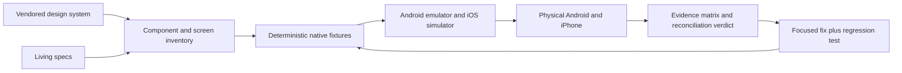

# Design-system and runtime reconciliation design

## Approach

The goal uses four evidence layers. A higher layer may reveal a problem that a
lower layer cannot, and no lower layer substitutes for the layer above it.

1. **Contract inventory** — map the design manifest, tokens, prompts, and kit
   screens to native components, call sites, state owners, and existing tests.
2. **Deterministic presentation** — render fixture-controlled states on Android
   and iOS and compare them with the corresponding design-system component or
   kit definition.
3. **Interactive native flows** — drive the real app through navigation,
   persistence, permissions, cancellation, failure, retry, rotation, theme,
   locale, and accessibility changes.
4. **Physical capability proof** — exercise real microphones, recognizers,
   local-model runtimes, playback, background work, memory pressure, and
   lifecycle transitions on eligible Android and iPhone hardware.

## Mapping record

Each design component or screen records:

- design source, prompt, type contract, and relevant token definitions;
- native implementation and every production call site;
- owning state/hook/service for interactive behavior;
- existing unit, integration, native, and Maestro coverage;
- required fixture/live states and device targets;
- parity status: `match`, `intentional-native-deviation`, `missing`, `defect`, or
  `blocked`, with evidence.

Intentional native deviations require a functional or platform reason and must
preserve the approved visual hierarchy. They are not silently accepted because
React Native differs from the web specimen.

## Test surfaces

- Use the existing `.maestro` fixture identity for deterministic Free/Premium,
  phase, conversation, and settings states.
- Extend Maestro only where accessibility IDs and deterministic state make the
  flow reliable. Native instrumentation remains responsible for audio,
  waveform, foreground-service, playback, and lifecycle races.
- Use development builds for real onboarding and local-model flows. Never use
  Expo Go as native evidence.
- Capture the native accessibility tree beside screenshots when layout alone
  cannot prove visibility or focus.
- Compare geometry and semantic state, not browser rasterization. Platform font
  rendering and native control rasterization are allowed to differ; tokens,
  hierarchy, dimensions, state, copy, and accessibility are not.

## Run records

Each run writes beneath
`artifacts/design-system-reconciliation/<commit>/<target>/<run-id>/`:

- `manifest.json` with build/device/environment facts;
- `screenshots/` and, where supported, accessibility hierarchy dumps;
- sanitized test logs;
- a concise `verdict.md` listing passes, defects, and blockers.

No credentials, prompts, transcripts, provider bodies, or model output are
retained in these artifacts.

## Fix discipline

Work in coherent batches by boundary: foundations, workspace/orb, introduction,
settings, on-device setup/models, chat/conversations, then cross-cutting
accessibility and lifecycle. Trace every failed interaction from its screen
entry point through controller/hook, service/native boundary, persistence, and
configuration before changing code.
