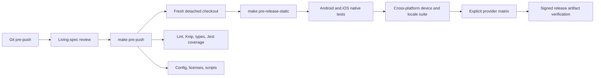

# Validation and Release Automation Specification

## Purpose

Automation turns repository policy into repeatable evidence. Scripts must be
safe to run locally, fail with actionable diagnostics, avoid secret leakage,
and distinguish spend-free development checks from explicit device, signing,
and quota-consuming release work.

The `Makefile` is the human entry point. Node scripts own portable orchestration
and verification; platform build systems own compilation.

## Validation Layers

A spend-free cloud mirror of the local gate runs in GitHub Actions
(`.github/workflows/ci.yml`) on every push and pull request: install, native
configuration parity, lint, dead-code checks, typechecks, script test suites,
Jest with coverage floors, and the license/release-note/store-promo contracts.
It needs no secrets and never builds release artifacts; device, native-build,
and paid provider phases remain local-only. The remote run makes the gates
enforced rather than advisory — a `--no-verify` push no longer bypasses
validation silently.

`make pre-push` is spend-free and non-interactive. Live provider calls and
Maestro device work must never be hidden in the Git hook.

The cross-platform Maestro suite starts from cleared app state and verifies
the current first-run contract: the app opens directly into the workspace with
the optional introduction banner. It must not wait for a retired blocking
setup wizard before exercising settings, locales, layout, or accessibility.
Flows that edit nested Settings sheets dismiss the software keyboard and, on
platforms where that action leaves the modal open, the owning sheet before
navigating the parent frame, so system input overlays cannot consume the next
app control.
The checked-in runtime flows also hold every voice-orb phase and ring boundary
deterministically under the isolated fixture identity, and prove honest
low-memory automatic-setup failure and retry on Android without downloading a
model. A separate physical-device flow accepts a real proposal, waits through
download, checksum verification, and benchmarks, then verifies the selected
Thinking route and Data & privacy storage inventory; it is never part of an
emulator or Git-hook run. Local-model catalogue flows follow the product's
stage ownership: Thinking for response models, Listening for recognition, and
Speaking for voices. Verified models expose a stable viable-state selector so
device tests wait for the real benchmark result rather than translated copy.
The verifier scans every checked-in Maestro YAML file and rejects selectors
from the retired standalone Device page.

## Living-Spec Review

The pre-push hook first runs `pre-push-spec-review.sh` over the commits actually
being pushed. A code-bearing push must acknowledge four questions: whether an
existing spec changed, whether a new spec is required, whether boundaries
should be restructured, and whether obsolete documentation should be dropped.

Acknowledgement is supplied by either:

- `SPEC_REVIEW_ACK` containing a substantive answer; or
- a `Spec-Review:` commit trailer in the pushed range.

Docs-only pushes bypass the prompt. The script reports changed implementation
files, changed living specs, and the closest ancestor specs; it does not decide
the architectural answer for the author.

## Script Contract

- Scripts resolve the repository root from their own location or an explicit
  input; they do not depend on the caller's shell directory accidentally.
- Checks are deterministic and testable with fixture repositories or injected
  command runners.
- Native configuration parity includes Release-only R8/JNI invariants whose
  absence cannot be exercised by the Debug instrumentation build.
- Non-zero exit means the requested evidence was not produced. Missing tools,
  devices, credentials, symbols, mappings, or reports are failures when the
  target promises them.
- Sensitive environment variables are never printed. Artifact scanning uses
  exact configured values without persisting those values into reports.
- Temporary work uses an isolated temporary directory and cleans it on success
  and failure.
- Generated evidence belongs under ignored `artifacts/`; checked-in source
  files remain the configuration authority.
- The espeak-free installer also applies the reviewed iOS archive-helper patch:
  it skips only empty, `.`, or `./` tar-root records, then permits only relative
  regular files or directories without traversal or links; direct validation
  runs before the helper rewrites accepted relative paths under its absolute
  target, and libarchive's symlink protection applies while writing. A clean
  dependency install must receive this patch before a native iOS build. It also
  corrects the helper's payload-write check: libarchive returns the
  `ARCHIVE_OK` zero status on success, not the number of requested bytes. The
  patch also resolves the already-created output directory before entry paths
  are composed, allowing iOS's system `/var` container alias without weakening
  archive-entry link checks. The script also patches the Sherpa TTS wrapper to
  reject either an absent wrapper or a null underlying engine before reading
  its sample rate, turning a native-model initialization failure into a
  recoverable JavaScript error. Runtime verification rejects native archives
  that still contain upstream VITS checks for eSpeak's monolithic data files;
  their presence proves the archive predates the libphonemize pack-only
  contract even when its licence scan is otherwise clean.

## Release Rules

- Repository metadata is the version source of truth. `bump-version.mjs`
  changes the Expo/package version, Android `versionCode`, and iOS build number
  together.
- Release builds set `EXPO_NO_DOTENV=1`.
- `prerelease-preflight` validates the entire secret, signing, and conservative
  cost-ceiling contract before any paid request.
- The paid provider matrix is run only for an explicit new-version request and
  derives its coverage from the runtime provider manifest.
- Android artifact verification checks the archive, signature, package,
  version, R8 mapping, native symbols, size budgets, hashes, and secret scan.
- Store-promo capture uses the `.maestro` identity and deterministic fixture
  state. Its outputs are marketing artifacts, not runtime test fixtures for
  production.

## Change Checklist

When changing automation:

1. update the closest script test or Makefile contract test;
2. keep a dry, fixture, or injected path for destructive, paid, signed, or
   device-dependent behavior;
3. preserve `EXPO_NO_DOTENV=1` for native Release bundles;
4. update `AGENTS.md` and operational docs when the command contract changes;
5. update this spec when validation boundaries or evidence requirements change;
   and
6. run `make pre-push` before committing.
