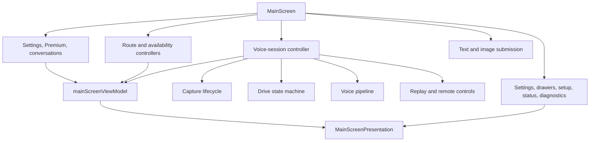
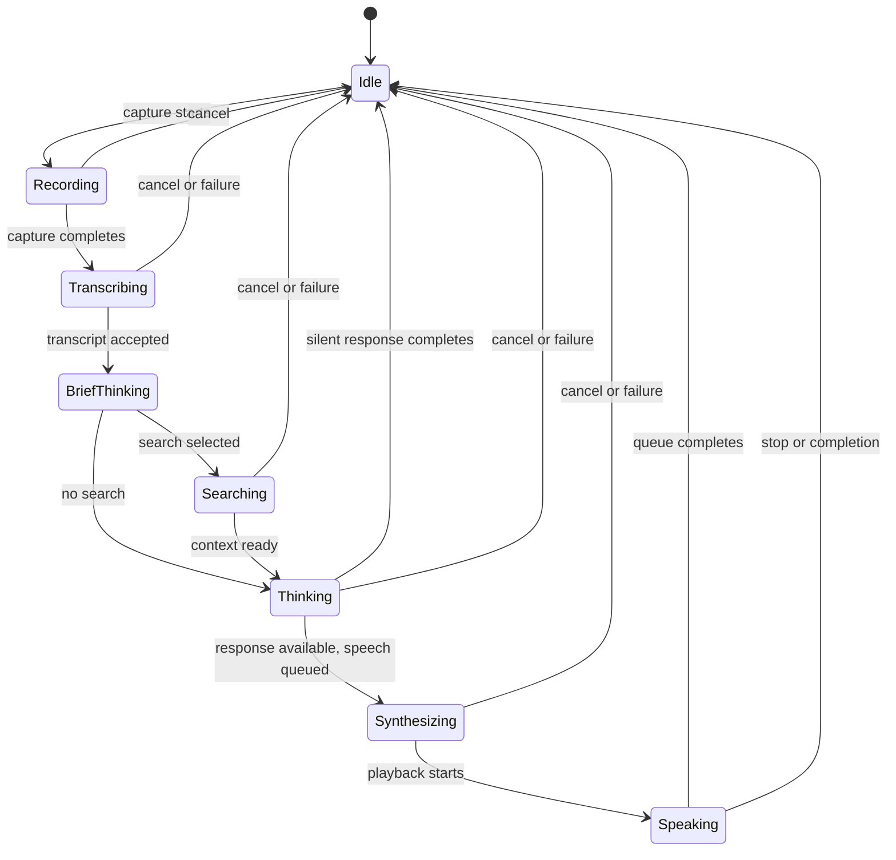
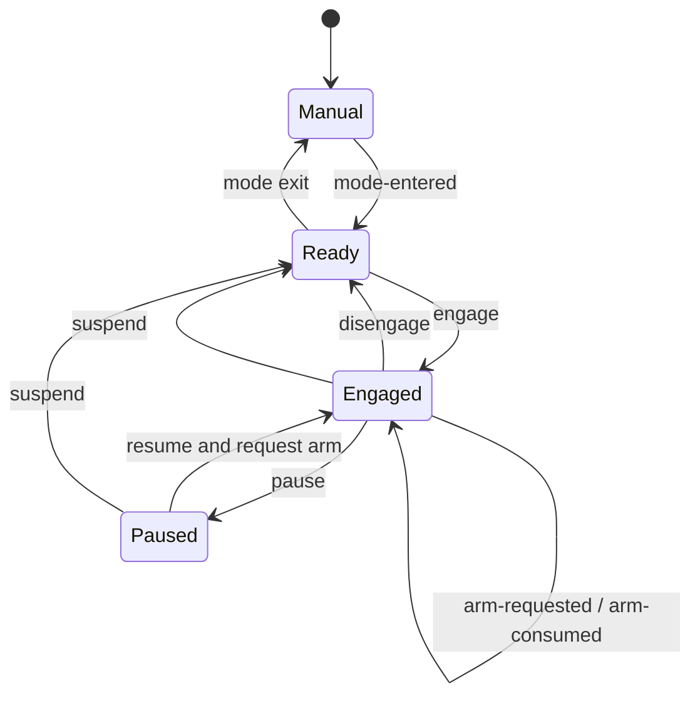

# Main Conversation Workspace Design

## Controller Composition

The root screen assembles controllers in dependency order and passes a
presentation model down once. Controller hooks own effects and mutable refs;
presentation files own layout, gestures, and accessibility labels.

## Turn State

The voice pipeline owns semantic processing phases. The workspace combines
those phases with recorder and player truth to derive the visible phase:

Recorder and player state outrank a stale pipeline callback when deriving the
visual phase. Streaming content is projected into the transcript until the
assistant message is committed.

## Cancellation and Stale Results

One user action can span recording, a pipeline request, streaming, TTS
generation, native playback, Drive continuation, and persistence. The
workspace therefore combines:

- an abort controller for the active pipeline;
- generation or request identifiers for callback freshness;
- refs for current conversation, settings, and lifecycle state;
- native playback stop/clear commands; and
- Drive-session disengagement when continuation is no longer safe.

**Decision:** Cancellation is an outcome, not an error to retry. Late results
may be ignored but must not append messages or re-arm listening.

## Drive Session State

`autoContinueEnabled`, `engaged`, and `armRequested` are separate because each
answers a different question: whether the mode permits continuation, whether
the user currently authorizes it, and whether exactly one future capture has
been requested.

## Surface State

Secondary surfaces are coordinated centrally so modal focus, dismissal, and
back behavior remain deterministic. Opening one mutually exclusive modal closes
the previous one through an explicit surface action. Conversation drawers may
remain contextual, but no hidden surface owns authoritative app data. The
route-picker and transcript sheets follow the same rule: their visibility
lives in `useMainScreenUiState`, not inside the workspace tree.

`useOrbTurnProgress` takes one clock snapshot whenever semantic voice state
changes, then supplies the remaining linear durations to `VoiceOrb`. The orb
uses Reanimated UI-thread clocks for recording, whole-turn estimate, and late
tail progress, so both rings stay smooth while streamed text updates compete on
the JS thread. Recording fills the inner ring against the capture cap, the
speech-start estimate drives the outer ring, and the estimated deadline swaps
completed ink for the approved track plus red tail without a JS timer.
Processing phases carry no per-phase estimate, so their inner ring deliberately
rests on the phase tint rather than faking a fraction.

The isolated `.maestro` screenshot identity may replace the visual phase and
both ring fractions with validated deterministic values. That override enters
at the presentation boundary after the live hook still runs, never mutates the
pipeline, and is unavailable to production and development identities.

The workspace owns the status label for the active input surface. The pager
opens on voice and only a deliberate page-control press or horizontal gesture
moves it to text; capability checks disable the orb and surface an explicit
settings notice without changing the selected surface or opening onboarding.

## Evidence

- [`mainScreenViewModel.ts`](./mainScreenViewModel.ts) — route labels, transcript
  projection, and visible phase derivation.
- [`voiceSession/driveSessionStateMachine.ts`](./voiceSession/driveSessionStateMachine.ts)
  — pure Drive Session transitions.
- [`useVoiceSessionController.ts`](./useVoiceSessionController.ts) — capture,
  pipeline, playback, and continuation composition.
- [`MainScreenPresentation.tsx`](./MainScreenPresentation.tsx) — presentation
  boundary.
- [`../../services/voicePipeline/DESIGN.md`](../../services/voicePipeline/DESIGN.md)
  — the processing pipeline below this screen.
