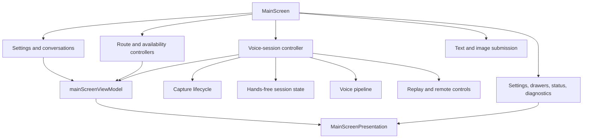
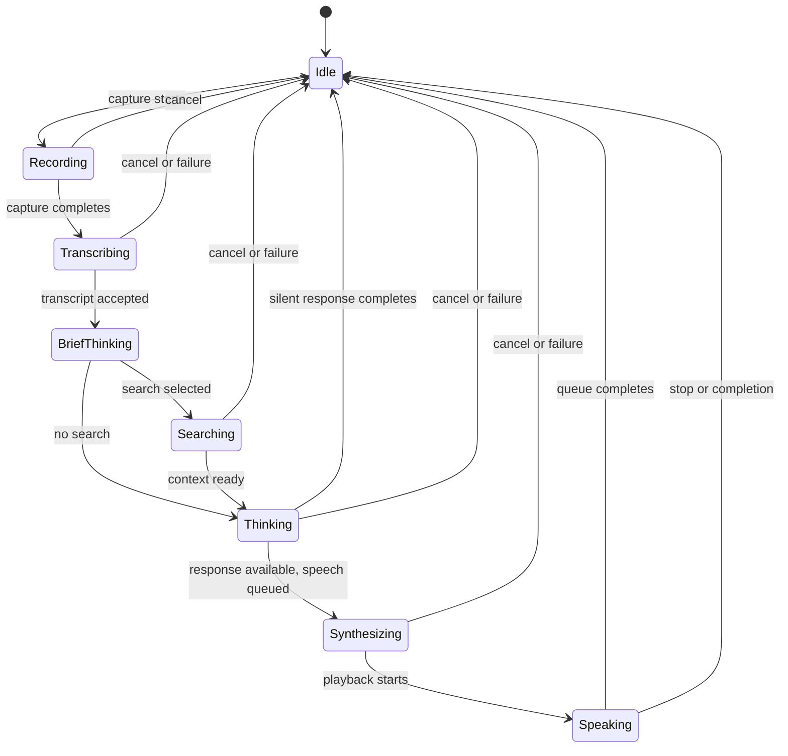
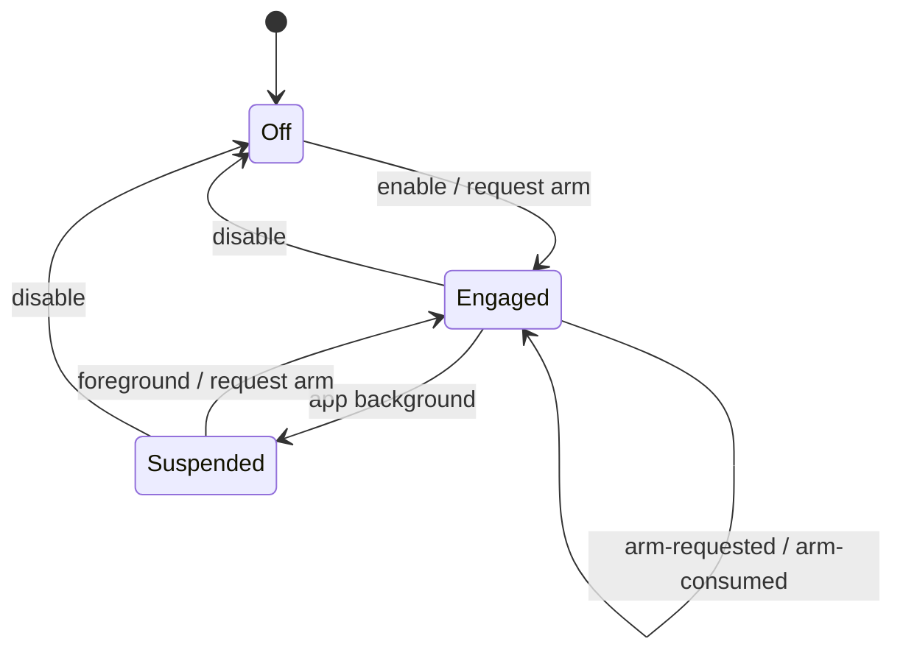

# Main Conversation Workspace Design

## Controller Composition

The root screen assembles controllers in dependency order and passes a
presentation model down once. Controller hooks own effects and mutable refs;
presentation files own layout, gestures, and accessibility labels.

## Turn State

The voice pipeline owns semantic processing phases. The workspace combines
those phases with recorder and player truth to derive the visible phase:

Recorder and player state outrank a stale pipeline callback when deriving the
visual phase. Streaming content is projected into the transcript until the
assistant message is committed.

## Cancellation and Stale Results

One user action can span recording, a pipeline request, streaming, TTS
generation, native playback, Hands-free continuation, and persistence. The
workspace therefore combines:

- an abort controller for the active pipeline;
- generation or request identifiers for callback freshness;
- refs for current conversation, settings, and lifecycle state;
- native playback stop/clear commands; and
- Hands-free suspension or disablement when continuation is no longer safe.

**Decision:** Cancellation is an outcome, not an error to retry. Late results
may be ignored but must not append messages or re-arm listening.

`usePlaybackReel` records every audio or native-speech unit with its paragraph
marker. Pipeline completion seals the reel, and only a later natural drain may
publish a full reading arc. This separates final completion from a temporary
stream gap. Each playback-start callback publishes an authoritative weighted
boundary plus an estimated duration to the active clip's next boundary; the
Reanimated ring interpolates that estimate off the JS thread and the next real
callback corrects it. Seeking uses a restart-specific native stop that retains
audio-session ownership and speaking presentation, adopts the resulting
generation marker, then re-reads the live unit list so a chunk that arrived
during the asynchronous stop is retained. A shared seek-intent guard prevents
that stop's empty-queue finalizer from masquerading as a natural drain, while
capture and replay identity checks prevent stale sessions from sealing a newer
reel. Restart uses the same guarded native teardown but resets the live reel to
unit zero; it does not call transcript replay while the voice session is active.

## Hands-Free Session State

`autoContinueEnabled`, `engaged`, and `armRequested` are separate because each
answers a different question: whether the session switch permits continuation,
whether the current surface can engage it, and whether exactly one future
capture has been requested. The persisted `inputMode` remains only manual
push-to-talk or toggle-to-talk; legacy `drive-session` values normalize to
toggle-to-talk.

`useDriveSessionVoiceActivity` consumes the recorder's `(metering,
sampleId)` pair. Native event handlers increment `sampleId` for every microphone
sample, including consecutive equal dB readings, because the detector's attack
and release thresholds count samples rather than distinct numeric values. Once
speech releases, the hook's independent 200ms clock derives the ten-second
silence countdown and calls the same `stopVoiceCapture` path as an explicit
stop. Route-aware ambient learning seeds the next recording but never performs
the stop itself.

## Adaptive iPad Composition

`MainScreen` resolves one resize-aware `IpadLayout` from the current window,
platform, and native iPad identity. Controllers, conversation data, input
drafts, composer-focus intent, and pipeline state remain above that decision.
Only presentation ownership changes:

- compact iPad and all phones render the existing phone workspace and modal
  conversations drawer;
- regular iPad moves that same drawer content into a persistent leading
  sidebar and renders the workspace beside it;
- regular portrait and narrower landscape retain the transcript handle and
  sheet; and
- landscape windows at least 1024pt wide dock the transcript as a third pane.

**Decision:** the 680pt regular boundary is the shared-tree approximation of
UIKit's size class, because React Native does not expose the live class during
Split View or Stage Manager resizing. Transcript docking is an independent
viability decision rather than an orientation synonym. This preserves a usable
centre stage when the approved sidebar and transcript widths cannot coexist.

The regular workspace still mounts `MainScreenVoiceStage`, route picker,
satellites, transcript content, and secondary-surface callbacks from the phone
composition. Changing width therefore changes geometry without creating a
second conversation runtime. Settings owns its own regular master-detail frame
but consumes the same controller and page content.

Crossing the regular boundary reparents the voice stage. The composer
controller therefore remembers whether the native text input actually had
focus and restores it once after that remount. Merely swiping to the text page
does not set that intent or open the keyboard. Drawer and transcript visibility
are likewise scoped to their modal presentations: entering persistent-sidebar
or docked-transcript layout retires the obsolete modal flag so a later shrink
cannot reopen a stale surface or suspend an active turn.

## Surface State

Secondary surfaces are coordinated centrally so modal focus, dismissal, and
back behavior remain deterministic. Opening one mutually exclusive modal closes
the previous one through an explicit surface action. Conversation drawers may
remain contextual, but no hidden surface owns authoritative app data. The
route-picker and transcript sheets follow the same rule: their visibility
lives in `useMainScreenUiState`, not inside the workspace tree.
When a transcript replay action targets Speaking settings, UI state hides the
sheet and queues the target until the native dismissal callback.
Because React Native does not deliver that callback on Android, a bounded
post-animation fallback drains the same single-consumer queue there. This keeps
two sibling native modals from being presented concurrently.
Data & privacy uses the same protocol in two stages when Archived conversations
is selected: its nested archive sheet dismisses before invoking the
Settings-to-drawer action, then Settings dismisses before the drawer opens with
Archived initially expanded. Each stage consumes its pending callback once, so
an iOS dismissal and the Android fallback cannot open the destination twice.
Settings and the conversation drawers use that same dismissal queue. The
workspace stays focus-isolated behind a transition cover while a destination
is pending; Settings closes any nested catalogue or archive sheet before its
own dismissal and only then presents the drawer destination.

`ChatTranscript` owns one expanded message ID. A conversation-key change clears
it so restored history opens folded; appending a new message to the same
conversation moves expansion to that latest row. `TranscriptMessage` owns the
script-row presentation and local metrics disclosure, while canonical removal
flows back through `useConversations`. The sessions drawer projects persisted
metadata into flat Pinned, Earlier, and Archived sections; branch provenance is
kept as a root-session link rather than encoded as visual tree rails.
The regular-iPad sidebar keeps that drawer controller mounted. A later Data &
privacy handoff therefore expands Archived reactively rather than assuming
drawer construction is the navigation boundary.

Locked-session selection is intercepted inside the drawer before its normal
select-and-close controller runs. The password/device-auth dialog delegates
verification to `MainScreen`, which grants the conversation ID in the
conversation hook only after success; only then does the usual conversation
switch reset the voice runtime and read the record. Failure closes only the
authentication dialog, leaves the drawer/sidebar overview mounted, and routes
the not-loaded explanation through the drawer-visible toast layer.
The lock form opts the shared dialog into whole-card keyboard avoidance on iOS,
so the title, fields, and footer move together instead of allowing the keyboard
to cover Set lock on compact phones. Focusing either password field also
collapses the explanatory paragraph for the remainder of that dialog opening;
the compact form then fits its fields and footer without the body's overflow
crossing the action area.

`useOrbTurnProgress` takes one clock snapshot whenever semantic voice state
changes, then supplies the remaining linear durations to `VoiceOrb`. The orb
uses one Reanimated UI-thread clock for the recording cap, the learned
route-specific submission-to-first-speech estimate, spoken-clip interpolation,
and late-tail progress. Per-processing-phase timing remains diagnostic input
but is deliberately absent from the visual. The single thick ring stays smooth
while streamed text updates compete on the JS thread and cannot expose a seam
between adjacent bands.
Speaking supplies a measured target short of one when only the current clip is
known; clip starts and stream growth correct that target without making the
animation a source of playback truth. The estimated deadline swaps completed
ink for the approved track plus red tail without a JS timer. Pausing cancels
the active interpolation while preserving the shared value; resuming restarts
only the remaining distance.

The isolated `.maestro` screenshot identity may replace the visual phase and
ring fractions with validated deterministic values. That override enters
at the presentation boundary after the live hook still runs, never mutates the
pipeline, and is unavailable to production and development identities.

The workspace owns the status label for the active input surface. The pager
opens on voice and only a deliberate 44pt chevron press or horizontal gesture
moves it to text; capability checks disable the orb and surface an explicit
settings notice without changing the selected surface.
The animated page track alone sits inside the pan recognizer. Both chevrons are
ordinary 44pt React Native touch targets in an absolute sibling layer, so a
failed pan finalizer cannot reset an arrow transition into a short wiggle. They
stay fully active whenever visible and do not inherit provider readiness. An
arrow lands the track one cycle toward its own side rather than at the incoming
page's canonical offset; the existing wrap transform therefore makes every
right-arrow transition enter from the right and every left-arrow transition
enter from the left, including repeated taps around the two-page circle. Arrow
and swipe navigation change only the visible page; neither focuses the composer
or opens the keyboard. A direct field action owns keyboard entry, and a layout
remount restores focus only when that field actually held it.
The portrait pager measures one central stage and derives the largest
orb-transport cluster that fits its height and the width between the two 44pt
chevrons, clamped from a 120pt orb to the portrait ceiling. `OrbTransport`
mounts at idle and active phases alike, reserving the footprint implied by the
orb plus the 34pt orbit. Its keys render only during a turn, so the primary
action never moves. The four satellite slots mount as the pager's footer, so
flexbox centers the complete orb-or-composer plus composing row rather than
assigning tall-screen surplus between those parts. The footer's 16pt margin
combines with the pager's 2pt child gap to preserve the design-system's 18pt
separation when no blocking notice intervenes; a route notice stays between
the primary action and next-turn controls. The text composer replaces the orb
rather than adding a competing call to action. Chevron selection and swipe
settling use a 220ms timing transition; no workspace pager motion springs or
bounces. Landscape uses the same cluster measurement under a 150pt ceiling,
retains Council, Web, and Hands free below the orb, and omits Image and the
portrait settings sentence.

`useConversationSettings` resolves each active session's sparse overrides over
the global defaults and keeps pre-message overrides pending until the first
conversation record is created. Its reset removes the stored override object,
so the session resumes inheritance instead of freezing a copy of the defaults.
Portrait combines the selected route and summary in `WorkspaceHeader`, a
quiet two-row raised block 14pt below the top bar. The summary lists the
effective length, tone, and voice as translated `Label: value` pairs separated
by middle dots, prefixed with Hands free while the session switch is enabled.
Its text plus trailing glyph is one row-sized press target. Landscape and
regular iPad retain the byline plus compact conversation-settings control.

When the native font scale reaches the accessibility-large range, the portrait
composition switches optional chrome to its existing compact forms: the
conversation-settings sentence becomes its labelled control and satellites
become icon-only. The blocked-route
notice, orb, semantic status, and transcript handle remain visible and keep
their normal accessible names; the adaptation removes no interaction.
Landscape applies the same threshold to the blocked-route card: its full
message remains the control's accessible name while the visible card contracts
to the actionable label, leaving the inline transcript and status unobscured.

The portrait transcript handle renders the translated stable title
`Transcript`; the message list still derives its accessible count, but model,
age, and reply preview are deliberately absent. The portrait sheet replaces
the generic elevated-card fill and dialog spacing with the transcript canvas:
an 18-point outer gutter, a compact 6-point list inset, and a 78-point header
containing the grip plus the same title. The whole header remains the labelled
tap-and-drag close target. `TranscriptPreviewCard` owns only the scrolling
script and message actions, so it cannot duplicate image, style, or
sheet-dismiss controls. Landscape mounts that same headerless transcript
content directly in the phone's right pane; a docked regular-iPad pane adds its
own `Transcript` heading above the shared content.

## Evidence

- [`mainScreenViewModel.ts`](./mainScreenViewModel.ts) — route labels, transcript
  projection, and visible phase derivation.
- [`voiceSession/driveSessionStateMachine.ts`](./voiceSession/driveSessionStateMachine.ts)
  — pure Hands-free transitions under the legacy internal filename.
- [`useVoiceSessionController.ts`](./useVoiceSessionController.ts) — capture,
  pipeline, playback, and continuation composition.
- [`MainScreenPresentation.tsx`](./MainScreenPresentation.tsx) — presentation
  boundary.
- [`../../services/voicePipeline/DESIGN.md`](../../services/voicePipeline/DESIGN.md)
  — the processing pipeline below this screen.
