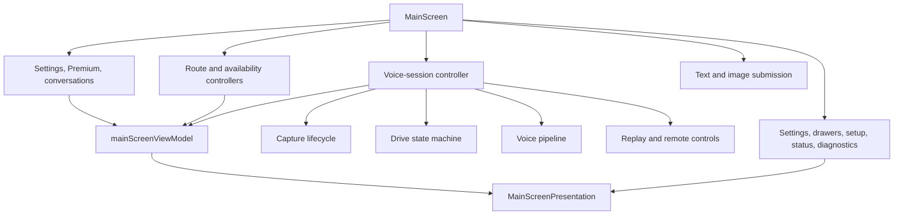
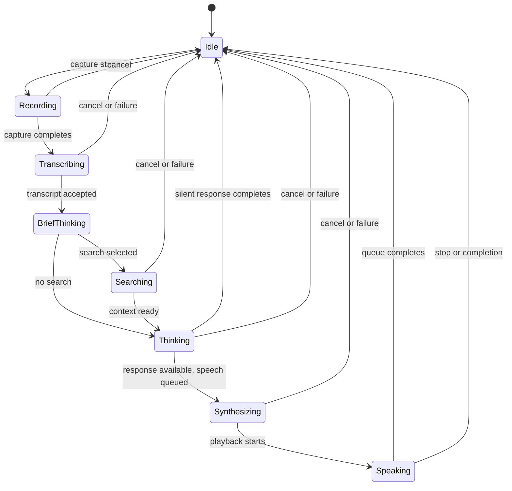
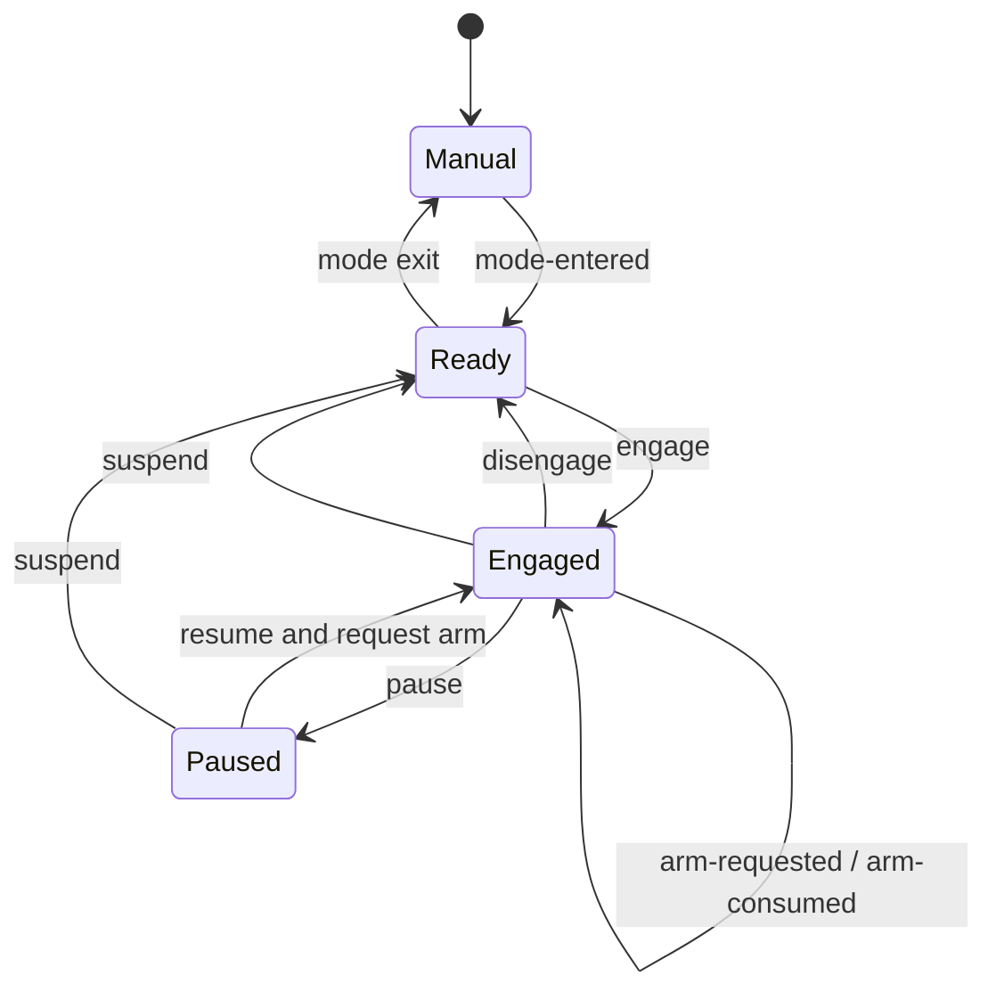

# Main Conversation Workspace Design

## Controller Composition

The root screen assembles controllers in dependency order and passes a
presentation model down once. Controller hooks own effects and mutable refs;
presentation files own layout, gestures, and accessibility labels.

## Turn State

The voice pipeline owns semantic processing phases. The workspace combines
those phases with recorder and player truth to derive the visible phase:

Recorder and player state outrank a stale pipeline callback when deriving the
visual phase. Streaming content is projected into the transcript until the
assistant message is committed.

## Cancellation and Stale Results

One user action can span recording, a pipeline request, streaming, TTS
generation, native playback, Drive continuation, and persistence. The
workspace therefore combines:

- an abort controller for the active pipeline;
- generation or request identifiers for callback freshness;
- refs for current conversation, settings, and lifecycle state;
- native playback stop/clear commands; and
- Drive-session disengagement when continuation is no longer safe.

**Decision:** Cancellation is an outcome, not an error to retry. Late results
may be ignored but must not append messages or re-arm listening.

The introduction's live test records through the shared recorder. Provider or
downloaded STT enters the normal pipeline directly; native STT first uses the
platform file recognizer and passes its result as a transcription override.
The intro owns no conversation state, but it does track the playback it
enqueues so exit and unmount stop that audio without touching playback that was
already active before the flow opened. Starting another test stops the same
owned playback and clears replay state. Exit and unmount abort platform file
recognition, serialize recorder teardown, and delete both active and late
capture URIs; player cancellation is reset before each new test and replay.

First-run reachability is based on the exact active response mode that the test
snapshot will execute. Provider routes must be credential-ready; local routes
must have a verified artifact and a viable benchmark matching the current
device. Availability of another response mode cannot unlock Try for an
unavailable active route. Losing that readiness deactivates the test controller,
which aborts capture, generation, and owned playback before the pager returns a
first run to Setup.

`usePlaybackReel` records every audio or native-speech unit with its paragraph
marker. Pipeline completion seals the reel, and only a later natural drain may
publish a full reading arc. This separates final completion from a temporary
stream gap. Seeking stops native playback, adopts the resulting generation
marker, then re-reads the live unit list so a chunk that arrived during the
asynchronous stop is retained. A shared seek-intent guard prevents that stop's
empty-queue finalizer from masquerading as a natural drain, while capture and
replay identity checks prevent stale sessions from sealing a newer reel.

## Drive Session State

`autoContinueEnabled`, `engaged`, and `armRequested` are separate because each
answers a different question: whether the mode permits continuation, whether
the user currently authorizes it, and whether exactly one future capture has
been requested.

## Surface State

Secondary surfaces are coordinated centrally so modal focus, dismissal, and
back behavior remain deterministic. Opening one mutually exclusive modal closes
the previous one through an explicit surface action. Conversation drawers may
remain contextual, but no hidden surface owns authoritative app data. The
route-picker and transcript sheets follow the same rule: their visibility
lives in `useMainScreenUiState`, not inside the workspace tree.
When a transcript replay action targets Speaking settings, UI state hides the
sheet and queues the target until the native dismissal callback.
Because React Native does not deliver that callback on Android, a bounded
post-animation fallback drains the same single-consumer queue there. This keeps
two sibling native modals from being presented concurrently.
Data & privacy uses the same protocol in two stages when Archived conversations
is selected: its nested archive sheet dismisses before invoking the
Settings-to-drawer action, then Settings dismisses before the drawer opens with
Archived initially expanded. Each stage consumes its pending callback once, so
an iOS dismissal and the Android fallback cannot open the destination twice.
Intro, Settings, and Premium use that same dismissal queue. The workspace stays
focus-isolated behind a transition cover while a destination is pending;
Settings closes any nested catalogue or archive sheet before its own dismissal,
and only then presents Premium, the drawer, or the returning Intro visit. A
cancelled purchase restores the originating Settings page or the same Intro
Setup visit, while a completed purchase clears the whole Intro return chain.

`ChatTranscript` owns one expanded message ID. A conversation-key change clears
it so restored history opens folded; appending a new message to the same
conversation moves expansion to that latest row. `TranscriptMessage` owns the
script-row presentation and local metrics disclosure, while canonical removal
flows back through `useConversations`. The sessions drawer projects persisted
metadata into flat Pinned, Earlier, and Archived sections; branch provenance is
kept as a root-session link rather than encoded as visual tree rails.

`useOrbTurnProgress` takes one clock snapshot whenever semantic voice state
changes, then supplies the remaining linear durations to `VoiceOrb`. The orb
uses Reanimated UI-thread clocks for recording, whole-turn estimate, each
processing phase, and late-tail progress, so both rings stay smooth while
streamed text updates compete on the JS thread. Recording fills the inner ring
against the capture cap, the learned route-specific speech-start estimate
drives the outer ring, and each learned phase estimate drives the inner ring
from transcription through synthesis. The estimated deadline swaps completed
ink for the approved track plus red tail without a JS timer.

The isolated `.maestro` screenshot identity may replace the visual phase and
both ring fractions with validated deterministic values. That override enters
at the presentation boundary after the live hook still runs, never mutates the
pipeline, and is unavailable to production and development identities.

Its dedicated onboarding scene follows a narrower boundary. The ordinary
automatic-setup hook remains mounted but suspended, and a proposal selected
from the checked-in device snapshot is passed only to Intro. Settings and the
home task row continue to receive the same suspended job. The projected Free
controller remains setup-incomplete, so the fixture can show the recommendation
without unlocking Try or applying a route. Store-promo identity loading and all
active scenes also suspend automatic setup and provider voice-directory work;
onboarding suppresses Intro's live catalogue install and benchmark readers.
The fixture therefore cannot scan hardware or files, start model work, or call
a provider while producing its deterministic recommendation.

The workspace owns the status label for the active input surface. The pager
opens on voice and only a deliberate 44pt chevron press or horizontal gesture
moves it to text; capability checks disable the orb and surface an explicit
settings notice without changing the selected surface or opening onboarding.
The chevron is an explicit text-entry action and focuses the composer after its
transition. A horizontal swipe changes only the visible page, preserving focus
and keyboard state so the workspace does not jump vertically at gesture end.
The portrait pager measures one central stage and derives the largest orb that
fits its height and the width between the two 44pt chevrons, clamped from 96pt
to the portrait ceiling. Its viewport is bounded by that ceiling and the three
satellite slots mount as the pager's footer, so flexbox centers the complete
orb-or-composer plus controls cluster instead of assigning tall-screen surplus
between those two parts. The footer's 16pt margin combines with the pager's 2pt
child gap to preserve the design-system's 18pt separation when no blocking
notice intervenes; a route notice stays between the primary action and those
next-turn controls. The text composer replaces the orb rather than adding a
second competing call to action. Chevron selection and swipe settling use a
220ms timing transition; no workspace pager motion springs or bounces.
Satellite enabled state remains independent, keeping the stage stable as route
capabilities change. Landscape uses the same measurement under its lower
ceiling, retains only Council and Web below the orb, and omits the portrait
settings sentence.

When the native font scale reaches the accessibility-large range, the portrait
composition switches optional chrome to its existing compact forms: the
introduction becomes title-only, the conversation-settings sentence becomes
its labelled control, and satellites become icon-only. The blocked-route
notice, orb, semantic status, and transcript handle remain visible and keep
their normal accessible names; the adaptation removes no interaction.
Landscape applies the same threshold to the blocked-route card: its full
message remains the control's accessible name while the visible card contracts
to the actionable label, leaving the inline transcript and status unobscured.

The portrait transcript handle derives the latest assistant model and
localized relative age in `mainScreenViewModel.ts`. The formatter feature-tests
`Intl.RelativeTimeFormat` because some Hermes Release runtimes omit it; those
runtimes receive a compact localized time or date from `Intl.DateTimeFormat`
instead, with an ISO timestamp as the last non-throwing fallback. The portrait
sheet replaces the generic elevated-card fill and dialog spacing with the
transcript canvas: an 18-point outer gutter, a compact 6-point list inset, and
the 44-point labelled grip as its only chrome. `TranscriptPreviewCard` owns only
the scrolling script and message actions, so it cannot duplicate image, style,
or sheet-dismiss controls. Landscape mounts that same headerless transcript
content directly in the right pane.

## Evidence

- [`mainScreenViewModel.ts`](./mainScreenViewModel.ts) — route labels, transcript
  projection, and visible phase derivation.
- [`voiceSession/driveSessionStateMachine.ts`](./voiceSession/driveSessionStateMachine.ts)
  — pure Drive Session transitions.
- [`useVoiceSessionController.ts`](./useVoiceSessionController.ts) — capture,
  pipeline, playback, and continuation composition.
- [`MainScreenPresentation.tsx`](./MainScreenPresentation.tsx) — presentation
  boundary.
- [`../../services/voicePipeline/DESIGN.md`](../../services/voicePipeline/DESIGN.md)
  — the processing pipeline below this screen.
