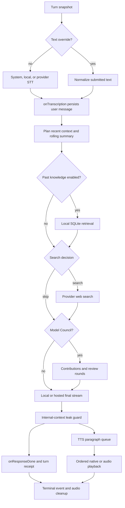
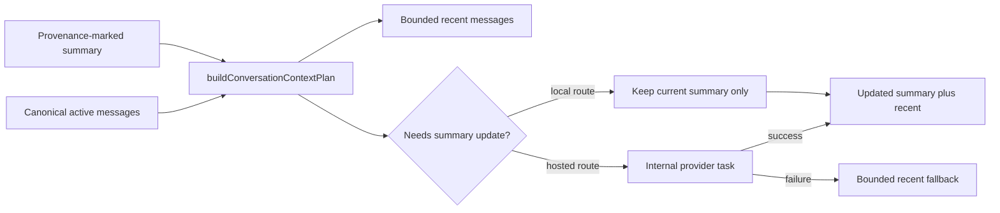
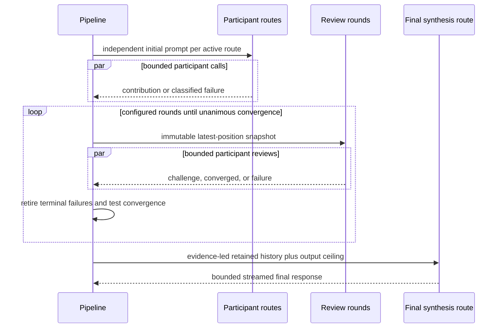

# Voice Pipeline Design

## Stage Graph

Every conditional stage returns an explicit result rather than mutating shared
globals. `runVoicePipeline` owns ordering and the turn receipt; focused modules
own their stage behavior.

## Callback Boundary

The service does not know React state. `PipelineCallbacks` translates runtime
events into the active controller:

- `onTranscription` persists the user message and may return a newly created
  conversation ID;
- phase callbacks drive recording/thinking/search/speech presentation;
- `onChunk` updates the visible streamed response;
- `onContextSummary` persists a new compact summary and its usage event;
- `onResponseDone` persists the completed assistant message and metadata;
- speech/audio-ready callbacks feed the platform playback queue; and
- `onError` performs localized user-facing failure handling.

**Decision:** The effective conversation ID is accepted back from
`onTranscription` because the first user turn may create a conversation after
the pipeline started.

## Context Planning

Only summaries carrying the current provenance marker are reused as generated
summary state. Older unmarked memory may be displayed/edited but is not silently
trusted as current compaction output.

## Model Council Orchestration

Participant completions are logged as they settle, but round progression waits
for all active calls. Terminal failure retirement avoids repeatedly paying for
an unusable route. If the requested synthesis provider has an open failure
circuit, the pipeline may select a successful participant route and records the
fallback. The final visible stream also carries an app-owned character ceiling,
so transport-specific token defaults cannot turn unusually long synthesis into
unbounded JavaScript, rendering, or TTS work.

## TTS Queue

The TTS queue separates synthesis scheduling from ordered output:

1. stream chunks accumulate until a complete paragraph;
2. speech rendering removes visual-only formatting;
3. provider/local paragraphs split into engine-sized chunks;
4. up to two synthesis slots prefetch conversation playback;
5. a single output promise chain preserves source order;
6. explicit pause cues separate paragraphs; and
7. the first fatal synthesis error stops later output and notifies once.

Repeat playback uses one synthesis slot to avoid overlapping a replay request.
Native speech skips audio synthesis but retains the same paragraph and language
selection semantics. Wait-mode completion and repeat both split the complete
answer through the paragraph queue before synthesis, so provider audio and
native speech callbacks carry identical seek metadata.

## Abort and Cleanup

Abort checks sit after transcription, persistence callback, context, knowledge,
search, Model Council, and final generation. A late completion cannot call
`onResponseDone` after abort.

The top-level `finally` records cleanup and removes temporary audio unless the
transcription failure deliberately marked it for retention. Stage modules own
their timers and release listeners or abort-linking functions in their own
`finally` blocks.

## Failure Degradation

| Failure | Result |
| --- | --- |
| STT fails or returns empty | no model request; preserve non-aborted audio |
| Summary update fails | continue with bounded recent messages |
| Knowledge retrieval fails | continue without cross-session excerpts |
| Web search fails | continue without search and persist an inline assistant notice |
| Some Uber participants fail | continue with successful routes; report degraded/retired outcome |
| All Uber participants fail | final synthesis cannot proceed normally |
| Final synthesis exceeds its output ceiling | abort the provider stream and report an incomplete reply |
| Primary LLM route fails | bounded candidate fallback or user-visible error |
| TTS route fails | follow explicit fallback order or keep readable text reply, with an inline assistant notice |
| Abort occurs | stop downstream publication and clean up |

No degradation path may fabricate success metadata or hide the actual route.
Assistant-owned degradation notices are durable transcript metadata rather than
global toasts, preventing one failure from being announced twice or detached
from the reply it affected.

## Evidence

- [`../voicePipeline.ts`](../voicePipeline.ts)
- [`response.ts`](./response.ts)
- [`ttsQueue.ts`](./ttsQueue.ts)
- [`../ulraMode.ts`](../ulraMode.ts)
- [`../../../__tests__/services/voicePipeline.test.ts`](../../../__tests__/services/voicePipeline.test.ts)
